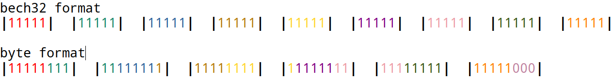

This step creates a reader that converts the bech32 5 bit format to normal 8 bit bytes.  The best way to understand why we start here is to look at the [bech32](https://github.com/bitcoin/bips/blob/master/bip-0173.mediawiki#bech32) spec, the table in the link shows how the individual letters that you normally see in a payment request are translated into numbers between 0-31.  We need this so we can take for example a 52 bech32 represetation of a payment hash and convert it to an actual 32 byte hash.

As you can see, the colors for the 5 bit segments only take a part of the eight bit bytes, so the first byte contains the 5 red from the first segment and 3 green from the second, the reamining 2 green start the second byte etc.

The code in this section sequences through one bit at a time through the 5 bit segments, tracking which segment and which position in the segment and creates the resulting eight bit segments.  The last eight bit segment in the above image has the 3 zeros at the end representing optional padding should you have an imbalance.
